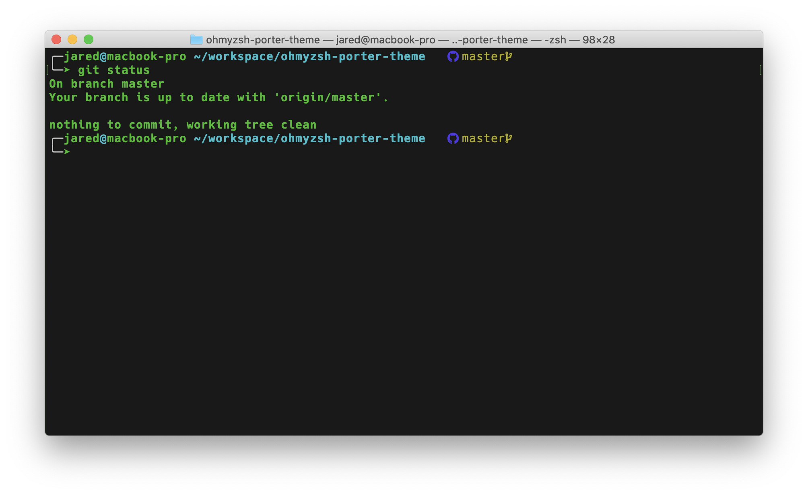
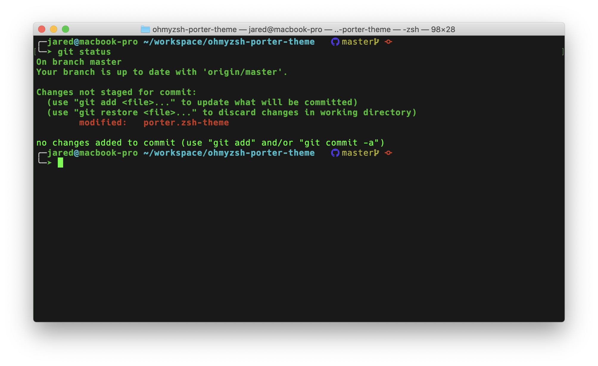

# Oh My Zsh Theme: "porter"

## Prerequisites

* A macOS operating system. Other Unix like systems may work.
    * Update: Confirmed working on Ubuntu
* [Zsh](https://www.zsh.org) should be installed (v4.3.9 or more recent). If not pre-installed (run `zsh --version` to confirm), check the following instructions here: [Installing ZSH](https://github.com/ohmyzsh/ohmyzsh/wiki/Installing-ZSH)
* Oh My Zsh should be installed. To learn more, visit [ohmyz.sh](https://ohmyz.sh)
* Installing [Nerd Fonts](https://www.nerdfonts.com/) is required for my theme to render properly. 

_Note: many other themes aside from my own require installing the [Powerline Fonts](https://github.com/powerline/fonts) in order to render properly. (e.g. "agnoster")._

## Basic Installation
1. Clone/download this repository to your computer.
2. Move the `porter.zsh-theme` file into the `~/.oh-my-zsh/themes` directory.
3. See below about enabling theme.


### Enabling Theme

_"Robby's theme is the default one. It's not the fanciest one. It's not the simplest one. It's just the right one (for him)."_ - Oh My Zsh

If you'd like to use my theme, you will need to edit the `~/.zshrc` file. You'll see an environment variable (all caps) in there that looks like:

```shell
ZSH_THEME="robbyrussell"
```

To use my theme, simply change the value to match the name of the theme. For example:

```shell
ZSH_THEME="porter"
```

### Conditional Theming
My theme looks favorably in both the Apple Terminal and Visual Studio Code.  However, it isn't so favorable in iTerm2. To combat this issue, I wrote a script within `~/.zshrc` to use the _"agnoster"_ theme with iTerm2 instead. For example:

```shell
# If running iTerm2
if [ "$TERM_PROGRAM" = "iTerm.app" ]; then
    ZSH_THEME="agnoster"

# If running Apple Terminal or Visual Studio Code
elif [ "$TERM_PROGRAM" = "Apple_Terminal" ] || [ "$TERM_PROGRAM" = "vscode" ]; then 
    ZSH_THEME="porter"

# Default zsh theme
else
    ZSH_THEME="robbyrussell" 
fi
```

## My CLI Preferences

### Apple Terminal:
* Homebrew color profile
* Font: SauceCodePro Nerd Font
* Oh My Zsh Theme: porter

### iTerm2:
* Solarized Dark color profile
* Font: Hack
* Oh My Zsh Theme: agnoster

### Visual Studio Code:
* Default Dark+ color profile
* Font: SauceCodePro Nerd Font
* Oh My Zsh Theme: porter

## Previews

### Home directory, after running neofetch command
_Note: neofetch is an installed package._

_Apple Terminal_


_iTerm2_ - Uses the _"anoster"_ theme with my conditional script


_Visual Studio Code_


_Ubuntu Terminal_


### Within a Git repository

Clean Working Tree


Unclean Working Tree


## Credits
* Oh My Zsh theming documentation.
* Inspiration based on "robbyrussell" and "gnzh" themes.

## Contributors
Open to accepting new contributors.

## Licenses
[](https://opensource.org/licenses/MIT)

Copyright (c) 2020 Jared Porter

Permission is hereby granted, free of charge, to any person obtaining a copy of this software and associated documentation files (the "Software"), to deal in the Software without restriction, including without limitation the rights to use, copy, modify, merge, publish, distribute, sublicense, and/or sell copies of the Software, and to permit persons to whom the Software is furnished to do so, subject to the following conditions:

The above copyright notice and this permission notice shall be included in all copies or substantial portions of the Software.

THE SOFTWARE IS PROVIDED "AS IS", WITHOUT WARRANTY OF ANY KIND, EXPRESS OR IMPLIED, INCLUDING BUT NOT LIMITED TO THE WARRANTIES OF MERCHANTABILITY, FITNESS FOR A PARTICULAR PURPOSE AND NONINFRINGEMENT. IN NO EVENT SHALL THE AUTHORS OR COPYRIGHT HOLDERS BE LIABLE FOR ANY CLAIM, DAMAGES OR OTHER LIABILITY, WHETHER IN AN ACTION OF CONTRACT, TORT OR OTHERWISE, ARISING FROM, OUT OF OR IN CONNECTION WITH THE SOFTWARE OR THE USE OR OTHER DEALINGS IN THE SOFTWARE.
